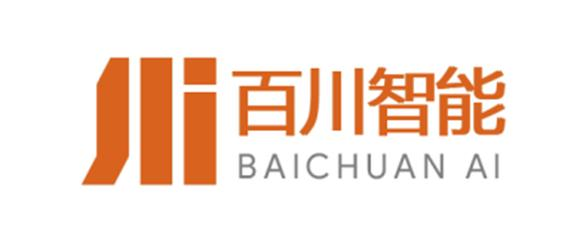

# About me
- I am currently a PhD candidate at the [Gaoling School of Artificial Intelligence](https://ai.ruc.edu.cn/), [Renmin University of China](https://www.ruc.edu.cn/). 
- I earned my bachelor's degree (2021) from [Shandong University](https://www.en.sdu.edu.cn).
- Research interests
  - Retrieval-augmented generation
  - Large language models for information retrieval
  - Context-aware document ranking

# News
- *2024.12*: We publish a new benchmark OmniEval, which omnidirectionally and automatically evaluates RAG systems in the financial domain! See more [details](https://arxiv.org/abs/2412.13018).

# Publications 
#### 2025
- ``COLING 2025`` [RichRAG: Crafting Rich Responses for Multi-faceted Queries in Retrieval-Augmented Generation](https://aclanthology.org/2025.coling-main.750/), **Shuting Wang**, Xin Yu, Mang Wang, Weipeng Chen, Yutao Zhu, and Zhicheng Dou.
- ``COLING 2025`` [FineRAG: Fine-grained Retrieval-Augmented Text-to-Image Generation](https://aclanthology.org/2025.coling-main.741.pdf), Huaying Yuan, Ziliang Zhao, **Shuting Wang**, Shitao Xiao, Minheng Ni, Zheng Liu, Zhicheng Dou.
- ``KDD 2025`` [Embedding Prior Task-specific Knowledge into Language Models for Context-aware Document Ranking](), **Shuting Wang**, Yutao Zhu, and Zhicheng Dou.

#### 2024
- ``arXiv 2024`` [OmniEval: An Omnidirectional and Automatic RAG Evaluation Benchmark in Financial Domain](https://arxiv.org/abs/2412.13018), **Shuting Wang**, Jiejun Tan, Zhicheng Dou, Ji-Rong Wen
- ``TKDE`` [PRADA: Pre-train Ranking Models with Diverse Relevance Signals Mined from Search Logs](https://ieeexplore.ieee.org/abstract/document/10807115), **Shuting Wang**, Zhicheng Dou, Kexiang Wang, Dehong Ma, Jun Fan, Daiting Shi, Zhicong Cheng, Simiu Gu, Dawei Yin, Ji-Rong Wen.
- ``arXiv 2024`` [Omnigen: Unified image generation](https://arxiv.org/abs/2409.11340), Shitao Xiao, Yueze Wang, Junjie Zhou, Huaying Yuan, Xingrun Xing, Ruiran Yan, Chaofan Li, **Shuting Wang**, Tiejun Huang, Zheng Liu
- ``arXiv 2024`` [LLMs+ Persona-Plug= Personalized LLMs](https://arxiv.org/abs/2409.11901), Jiongnan Liu, Yutao Zhu, **Shuting Wang**, Xiaochi Wei, Erxue Min, Yu Lu, Shuaiqiang Wang, Dawei Yin, Zhicheng Dou
- ``arXiv2024`` [DomainRAG: A Chinese Benchmark for Evaluating Domain-specific Retrieval-Augmented Generation](https://arxiv.org/abs/2406.05654), **Shuting Wang**, Jiongnan Liu, Shiren Song, Jiehan Cheng, Yuqi Fu, Peidong Guo, Kun Fang, Yutao Zhu, Zhicheng Dou
- ``TOIS 2024`` [Personalized and Diversified: Ranking Search Results in an Integrated Way](https://dl.acm.org/doi/full/10.1145/3631989) **Shuting Wang**, Zhicheng Dou, Jiongnan Liu, Qiannan Zhu, Ji-Rong Wen

#### 2023
- ``arXiv 2023`` [Large language models for information retrieval: A survey](https://arxiv.org/abs/2308.07107), Yutao Zhu, Huaying Yuan, **Shuting Wang**, Jiongnan Liu, Wenhan Liu, Chenlong Deng, Haonan Chen, Zheng Liu, Zhicheng Dou, Ji-Rong Wen
- ``WWW 2023`` [Incorporating explicit subtopics in personalized search](https://dl.acm.org/doi/abs/10.1145/3543507.3583488), **Shuting Wang**, Zhicheng Dou, Jing Yao, Yujia Zhou, Ji-Rong Wen
- ``WSDM 2023`` [Heterogeneous graph-based context-aware document ranking](https://dl.acm.org/doi/abs/10.1145/3539597.3570390), **Shuting Wang**, Zhicheng Dou, Yutao Zhu

# Experiences
- *2024.10 - now* Visiting Scholar, Carnegie Mellon University . 
- *2023.11 - 2024.10* Research Intern, Baichuan . 
- *2022.12 - 2023.10* Research Intern, Baidu . 
- *2021.7 - 2021.9*, Research Intern, Kuaishou . 

# Academic Services
- PC Member: WWW, SIGKDD, ACL Rolling Review, ICTIR
- Journal Reviewer: TPAMI, KAIS
